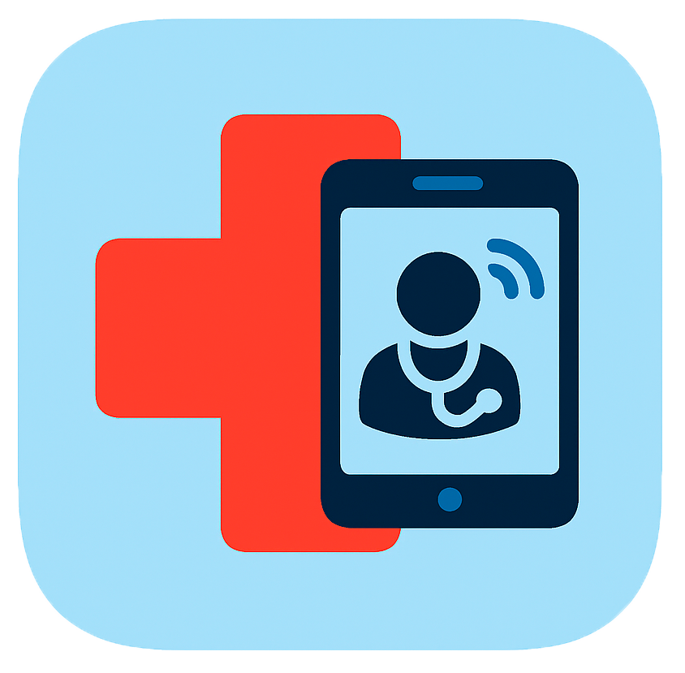

<h1 align="center">León Sokolowski</h1>

  

<h2 align="center"> Clinica Online</h2>

## Descripción
Nuestra clínica fue creada para que todo paciente, sea quien sea, tenga a su alcance la mejor atención brindada por los mejores especialistas en todas las ramas de la medicina. 
Desarrollamos esta página para poder gestionar sus turnos médicos de la forma más eficiente y práctica posible. Aquí tendrá una explicación de como manejarse por ella.

## Registro e inicio de sesión
Al entrar a la pagina lo recibirá el inicio de sesión, donde tendrá que colocar su correo y contraseña para ingresar. Si no tiene cuenta deberá clickear donde le ofrece registrarse.

Ahi le preguntará si como desea registrarse. Dependiendo de lo que desee deberá rellenar un formulario u otro. Luego de su registro lo redirigiran al ingreso, donde ya podrá hacer uso de sus creedenciales para acceder.

## Navegación por la página
Dependerá de su perfil de usuario el como interactuará con la página a partir de ahora. Asi que vamos por partes:
### Administrador
Desde la barra lateral podrá acceder a todas las paginas que le esten permitidas, siempre y cuando no se encuentre en ellas:
- La página de inicio
- La administración, desde ahi a:
  - Registro de administradores, donde podrá registrar a nuevos usuarios de ese perfil.
  - Administración de usuarios, teniendo la opción de habilitar o deshabilitar especialistas o borrar cualquier tipo de usuario de la pagina. Desde aqui podrá acceder a:
    - La historia clinica de cada paciente y descargarla en PDF.
- Estadisticas de la app representadas en graficos, podrá descargarlos en PDF.
- Mi perfil (explicado más abajo)
- Turnos (explicado más abajo)
- Solicitud de turnos (explicado más abajo)
- El cierre de sesión.

Desde la pagina de inicio podrá acceder a: 
- La pagina "Mi perfil", donde se muestra toda la información del usuario.
- La solicitud de turnos, donde podrá solicitar un turno para cualquier paciente.
- La sección Turnos, donde ve la información de los turnos solicitados, aceptados, rechazados, cancelados y finalizados, tenienedo la opción de recharzar los que estén solicitados.

### Paciente
Desde la barra lateral podrá acceder a todas las paginas que le esten permitidas, siempre y cuando no se encuentre en ellas:
- La página de inicio
- Mi perfil (explicado más abajo)
- Mis Turnos (explicado más abajo)
- Solicitud de turnos (explicado más abajo)
- El cierre de sesión

Desde la pagina de inicio podrá acceder a: 
- La pagina "Mi perfil", donde se muestra toda la información del usuario. Desde aquí podrá ver también su historia clinica y descargarla en PDF.
- La solicitud de turnos, donde podrá solicitar un turno.
- La sección Mis Turnos, donde ve la información de los turnos solicitados por él, aceptados, rechazados, cancelados y finalizados.
  - Para los aceptados puede cancelarlos, dando la razón.
  - Para los finalizados puede completar una encuesta, calificar la atención y ver su diagnóstico.

### Especialista
Desde la barra lateral podrá acceder a todas las paginas que le esten permitidas, siempre y cuando no se encuentre en ellas:
- La página de inicio
- Mi perfil (explicado más abajo)
- Mis Turnos (explicado más abajo)
- Sección Pacientes (explicado más abajo)
- El cierre de sesión

Desde la pagina de inicio podrá acceder a: 
- La pagina "Mi perfil", donde se muestra toda la información del usuario, además de subir su disponibilidad horaria.
- La página "Sección Pacientes", donde se encontrarán todos los pacientes que atendió por lo menos una vez. Desde ahí podrá acceder a:
  - La historia clinica de cada paciente y descargarla en PDF.
- La sección Mis Turnos, donde ve la información de los turnos solicitados con él, aceptados, rechazados, cancelados y finalizados.
  - Para los creados puede rechazarlos, dando la razón.
  - Para los aceptados puede cancelarlos, dando la razón; o finalizarlos, subiendo su diagnóstico y un comentario acerca del paciente.
